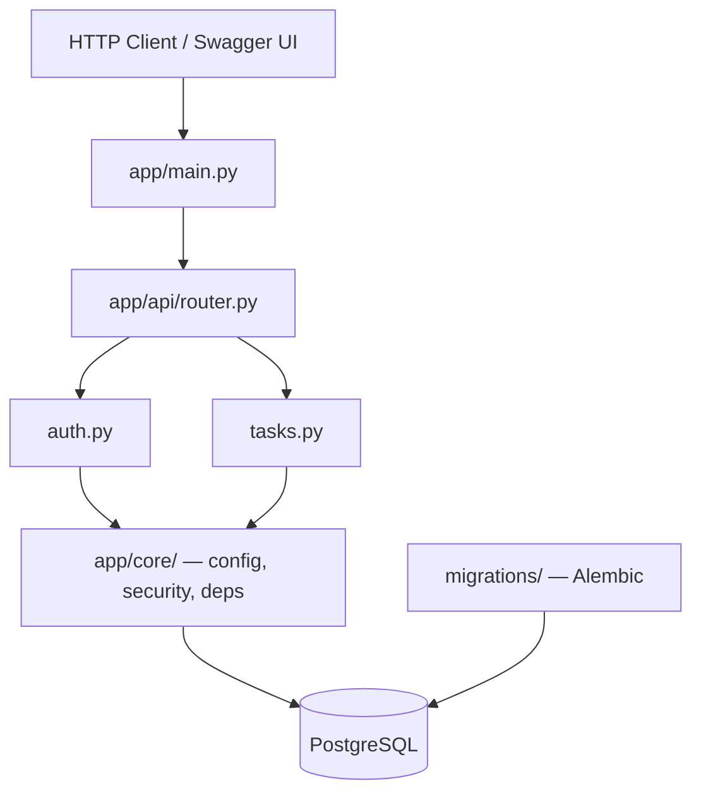

# Отчёт по лабораторной работе 1

**Студент:** Васильев Arthur  
**Группа:** k3340  
**Тема:** Time Manager API — серверное приложение тайм-менеджера  
**Стек:** FastAPI, SQLModel, PostgreSQL, Alembic, JWT, Docker

---

## Описание проекта

REST API для управления задачами, категориями, тегами, учётом времени и ежедневным расписанием. Реализована JWT-авторизация, 8 таблиц в PostgreSQL, связи one-to-many и many-to-many, миграции Alembic, контейнеризация Docker Compose.

## Архитектура



## Модель данных (8 таблиц)

| Таблица | Описание |
|---------|----------|
| `user` | Пользователи |
| `category` | Категории задач |
| `task` | Задачи (дедлайн, приоритет, статус) |
| `tag` | Теги |
| `tasktaglink` | M2M задача ↔ тег + `relevance` (0–100) |
| `timeentry` | Учёт затраченного времени |
| `schedule` | Ежедневное расписание |
| `scheduleitem` | Слоты расписания (связь с задачей) |

## Ссылки на GitHub

| Ресурс | Ссылка |
|--------|--------|
| Репозиторий | [ITMO_ICT_WebDevelopment_tools_2025-2026](https://github.com/pppestto/ITMO_ICT_WebDevelopment_tools_2025-2026) |
| Ветка `lab1` | [tree/lab1](https://github.com/pppestto/ITMO_ICT_WebDevelopment_tools_2025-2026/tree/lab1) |
| Папка LR1 | [students/k3340/Vasilev_Arthur/lab1/lr1](https://github.com/pppestto/ITMO_ICT_WebDevelopment_tools_2025-2026/tree/lab1/students/k3340/Vasilev_Arthur/lab1/lr1) |

!!! note "Перед защитой"
    Убедитесь, что код закоммичен и запушен в ветку `lab1`, иначе ссылки на GitHub будут недоступны.

## Разделы отчёта

- [Эндпоинты](endpoints.md) — полный список API-маршрутов
- [Модели данных](models.md) — SQLModel-сущности (финальная версия)
- [Подключение к БД](database.md) — код соединения и миграции
- [Практики](practices.md) — ссылки на pr1, pr2, pr3

## Деплой отчёта на GitHub Pages

```bash
pip install mkdocs mkdocs-material
mkdocs gh-deploy
```

Или в настройках репозитория: **Settings → Pages → Source: Deploy from branch `gh-pages`**.

## Запуск приложения

```bash
docker compose up --build
```

Документация API: [http://127.0.0.1:8000/docs](http://127.0.0.1:8000/docs)
