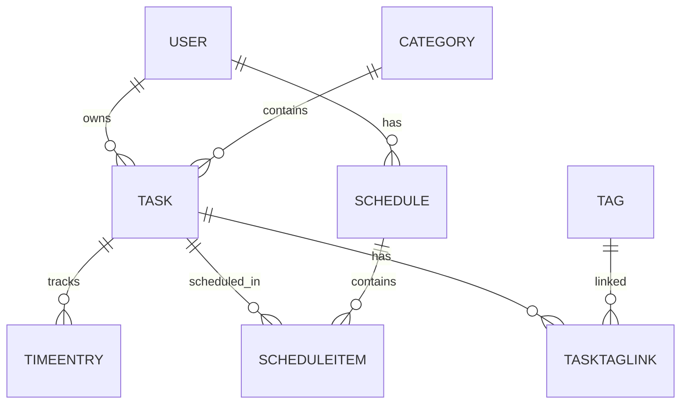

# Модели данных

Финальная версия SQLModel-моделей из `app/models/`.

## Диаграмма связей



---

## User — `app/models/user.py`

```python
from datetime import datetime
from typing import TYPE_CHECKING, Optional

from sqlmodel import Field, Relationship, SQLModel

if TYPE_CHECKING:
    from app.models.schedule import Schedule
    from app.models.task import Task


class User(SQLModel, table=True):
    id: Optional[int] = Field(default=None, primary_key=True)
    email: str = Field(unique=True, index=True, max_length=255)
    username: str = Field(unique=True, index=True, max_length=100)
    hashed_password: str = Field(max_length=255)
    full_name: Optional[str] = Field(default=None, max_length=200)
    is_active: bool = Field(default=True)
    created_at: datetime = Field(default_factory=datetime.utcnow)

    tasks: list["Task"] = Relationship(back_populates="owner")
    schedules: list["Schedule"] = Relationship(back_populates="user")
```

---

## Category — `app/models/category.py`

```python
from typing import TYPE_CHECKING, Optional

from sqlmodel import Field, Relationship, SQLModel

if TYPE_CHECKING:
    from app.models.task import Task


class Category(SQLModel, table=True):
    id: Optional[int] = Field(default=None, primary_key=True)
    name: str = Field(unique=True, max_length=100)
    description: Optional[str] = Field(default=None, max_length=500)
    color: Optional[str] = Field(default="#3498db", max_length=7)

    tasks: list["Task"] = Relationship(back_populates="category")
```

---

## Task — `app/models/task.py`

```python
from datetime import datetime
from enum import Enum
from typing import TYPE_CHECKING, Optional

from sqlmodel import Field, Relationship, SQLModel

if TYPE_CHECKING:
    from app.models.category import Category
    from app.models.schedule import ScheduleItem
    from app.models.tag import TaskTagLink
    from app.models.time_entry import TimeEntry
    from app.models.user import User


class Priority(str, Enum):
    low = "low"
    medium = "medium"
    high = "high"
    critical = "critical"


class TaskStatus(str, Enum):
    pending = "pending"
    in_progress = "in_progress"
    completed = "completed"
    cancelled = "cancelled"


class Task(SQLModel, table=True):
    id: Optional[int] = Field(default=None, primary_key=True)
    title: str = Field(max_length=200)
    description: Optional[str] = Field(default=None, max_length=2000)
    deadline: Optional[datetime] = Field(default=None)
    priority: Priority = Field(default=Priority.medium)
    status: TaskStatus = Field(default=TaskStatus.pending)
    estimated_minutes: Optional[int] = Field(default=None, ge=0)
    created_at: datetime = Field(default_factory=datetime.utcnow)
    updated_at: datetime = Field(default_factory=datetime.utcnow)

    owner_id: int = Field(foreign_key="user.id")
    category_id: Optional[int] = Field(default=None, foreign_key="category.id")

    owner: "User" = Relationship(back_populates="tasks")
    category: Optional["Category"] = Relationship(back_populates="tasks")
    time_entries: list["TimeEntry"] = Relationship(back_populates="task")
    tag_links: list["TaskTagLink"] = Relationship(back_populates="task")
    schedule_items: list["ScheduleItem"] = Relationship(back_populates="task")
```

---

## Tag и TaskTagLink — `app/models/tag.py`

```python
from datetime import datetime
from typing import TYPE_CHECKING, Optional

from sqlmodel import Field, Relationship, SQLModel

if TYPE_CHECKING:
    from app.models.task import Task


class Tag(SQLModel, table=True):
    id: Optional[int] = Field(default=None, primary_key=True)
    name: str = Field(unique=True, max_length=80)

    task_links: list["TaskTagLink"] = Relationship(back_populates="tag")


class TaskTagLink(SQLModel, table=True):
    """Ассоциативная сущность many-to-many: задача ↔ тег."""

    task_id: Optional[int] = Field(default=None, foreign_key="task.id", primary_key=True)
    tag_id: Optional[int] = Field(default=None, foreign_key="tag.id", primary_key=True)
    relevance: int = Field(default=50, ge=0, le=100, description="Важность тега для задачи (0–100)")
    assigned_at: datetime = Field(default_factory=datetime.utcnow)

    task: "Task" = Relationship(back_populates="tag_links")
    tag: Tag = Relationship(back_populates="task_links")
```

---

## TimeEntry — `app/models/time_entry.py`

```python
from datetime import datetime
from typing import TYPE_CHECKING, Optional

from sqlmodel import Field, Relationship, SQLModel

if TYPE_CHECKING:
    from app.models.task import Task


class TimeEntry(SQLModel, table=True):
    id: Optional[int] = Field(default=None, primary_key=True)
    started_at: datetime
    ended_at: Optional[datetime] = Field(default=None)
    duration_minutes: Optional[int] = Field(default=None, ge=0)
    note: Optional[str] = Field(default=None, max_length=500)

    task_id: int = Field(foreign_key="task.id")

    task: "Task" = Relationship(back_populates="time_entries")
```

---

## Schedule и ScheduleItem — `app/models/schedule.py`

```python
from datetime import date, time
from typing import TYPE_CHECKING, Optional

from sqlmodel import Field, Relationship, SQLModel

if TYPE_CHECKING:
    from app.models.task import Task
    from app.models.user import User


class Schedule(SQLModel, table=True):
    """Ежедневное расписание пользователя."""

    id: Optional[int] = Field(default=None, primary_key=True)
    title: str = Field(max_length=200)
    schedule_date: date
    notes: Optional[str] = Field(default=None, max_length=1000)

    user_id: int = Field(foreign_key="user.id")

    user: "User" = Relationship(back_populates="schedules")
    items: list["ScheduleItem"] = Relationship(back_populates="schedule")


class ScheduleItem(SQLModel, table=True):
    id: Optional[int] = Field(default=None, primary_key=True)
    start_time: time
    end_time: time
    order_index: int = Field(default=0, ge=0)

    schedule_id: int = Field(foreign_key="schedule.id")
    task_id: int = Field(foreign_key="task.id")

    schedule: Schedule = Relationship(back_populates="items")
    task: "Task" = Relationship(back_populates="schedule_items")
```

---

## Реэкспорт — `app/models/__init__.py`

```python
from app.models.category import Category
from app.models.schedule import Schedule, ScheduleItem
from app.models.tag import Tag, TaskTagLink
from app.models.task import Priority, Task, TaskStatus
from app.models.time_entry import TimeEntry
from app.models.user import User

__all__ = [
    "User",
    "Category",
    "Task",
    "TaskStatus",
    "Priority",
    "Tag",
    "TaskTagLink",
    "TimeEntry",
    "Schedule",
    "ScheduleItem",
]
```

[Исходники на GitHub → app/models/](https://github.com/pppestto/ITMO_ICT_WebDevelopment_tools_2025-2026/tree/lab1/students/k3340/Vasilev_Arthur/lab1/lr1/app/models)
