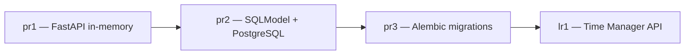

# Практики и ссылки на GitHub

Лабораторная работа LR1 — **финальная версия** проекта. Практики pr1–pr3 — промежуточные этапы, на которых отрабатывались отдельные навыки.

## Репозиторий и ветка

| | Ссылка |
|---|--------|
| **Репозиторий** | https://github.com/pppestto/ITMO_ICT_WebDevelopment_tools_2025-2026 |
| **Ветка lab1** | https://github.com/pppestto/ITMO_ICT_WebDevelopment_tools_2025-2026/tree/lab1 |
| **Папка студента** | https://github.com/pppestto/ITMO_ICT_WebDevelopment_tools_2025-2026/tree/lab1/students/k3340/Vasilev_Arthur |

!!! warning "Важно"
    Код пока не закоммичен в удалённый репозиторий. Перед защитой выполните `git add`, `git commit`, `git push` в ветку `lab1`.

---

## Практика 1 — FastAPI, in-memory CRUD

**Папка:** [lab1/pr1](https://github.com/pppestto/ITMO_ICT_WebDevelopment_tools_2025-2026/tree/lab1/students/k3340/Vasilev_Arthur/lab1/pr1)

| Что изучено | Описание |
|-------------|----------|
| FastAPI | Базовое API без БД |
| TypedDict / Pydantic | Модели данных |
| In-memory хранилище | `temp_bd: list[dict]` |
| CRUD | GET/POST/PUT/DELETE для warriors |

**Ключевые файлы:**

- `main.py` — эндпоинты warriors
- `models.py` — Profession, Warrior, Skill

---

## Практика 2 — SQLModel + PostgreSQL

**Папка:** [lab1/pr2](https://github.com/pppestto/ITMO_ICT_WebDevelopment_tools_2025-2026/tree/lab1/students/k3340/Vasilev_Arthur/lab1/pr2)

| Что изучено | Описание |
|-------------|----------|
| SQLModel | ORM-модели с `table=True` |
| PostgreSQL | Подключение через `connection.py` |
| CRUD API | `/skills_list`, `/skill/{id}`, `POST /skill` |
| M2M связь | `POST /skill_link`, `DELETE /skill_link/{warrior_id}/{skill_id}` |
| Вложенные данные | `GET /warrior/{id}/with_skills` |
| Docker Compose | PostgreSQL на порту 5433 |

**Ключевые файлы:**

- `main.py` — API с SQLModel Session
- `models.py` — Warrior, Skill, SkillWarriorLink
- `connection.py` — engine + get_session

**Документация практики:** [WebDevelopmentLabsDocs — pr2](https://rendex85.github.io/WebDevelopmentLabsDocs/lr2/pr2/)

---

## Практика 3 — Alembic миграции

**Папка:** [lab1/pr3](https://github.com/pppestto/ITMO_ICT_WebDevelopment_tools_2025-2026/tree/lab1/students/k3340/Vasilev_Arthur/lab1/pr3)

| Что изучено | Описание |
|-------------|----------|
| Alembic | Версионирование схемы БД |
| Миграции | `001_initial_tables`, `002_skill_added` |
| env.py | Подстановка `DB_ADMIN` из `.env` |
| Docker | Автоматический `alembic upgrade head` при старте |

**Ключевые файлы:**

- `migrations/versions/001_initial_tables.py` — начальная схема
- `migrations/versions/002_skill_added.py` — добавление таблицы skill
- `migrations/env.py` — конфигурация Alembic

**Документация практики:** [WebDevelopmentLabsDocs — pr3](https://rendex85.github.io/WebDevelopmentLabsDocs/lr2/pr3/)

---

## Лабораторная LR1 — финальный проект

**Папка:** [lab1/lr1](https://github.com/pppestto/ITMO_ICT_WebDevelopment_tools_2025-2026/tree/lab1/students/k3340/Vasilev_Arthur/lab1/lr1)

Объединяет все навыки из практик:

| Из pr1 | Из pr2 | Из pr3 | Новое в LR1 |
|--------|--------|--------|-------------|
| FastAPI роутеры | SQLModel ORM | Alembic | JWT-авторизация |
| Pydantic-схемы | PostgreSQL | Docker | 8 таблиц, сложные связи |
| CRUD паттерн | M2M через link-таблицу | Миграции | Дедлайн-алерты, анализ времени |
| | Session DI | | Расписание, Docker Compose |

---

## Эволюция проекта



---

## Как закоммитить для защиты

```bash
cd ITMO_ICT_WebDevelopment_tools_2025-2026
git checkout lab1
git add students/k3340/Vasilev_Arthur/
git commit -m "Добавлена лабораторная LR1 — Time Manager API"
git push origin lab1
```

После push ссылки на GitHub станут рабочими.

## Деплой отчёта (GitHub Pages)

Из папки `lr1`:

```bash
pip install mkdocs mkdocs-material
mkdocs gh-deploy
```

Сайт будет доступен по адресу:  
`https://pppestto.github.io/ITMO_ICT_WebDevelopment_tools_2025-2026/`

*(точный URL зависит от настроек GitHub Pages в репозитории)*
